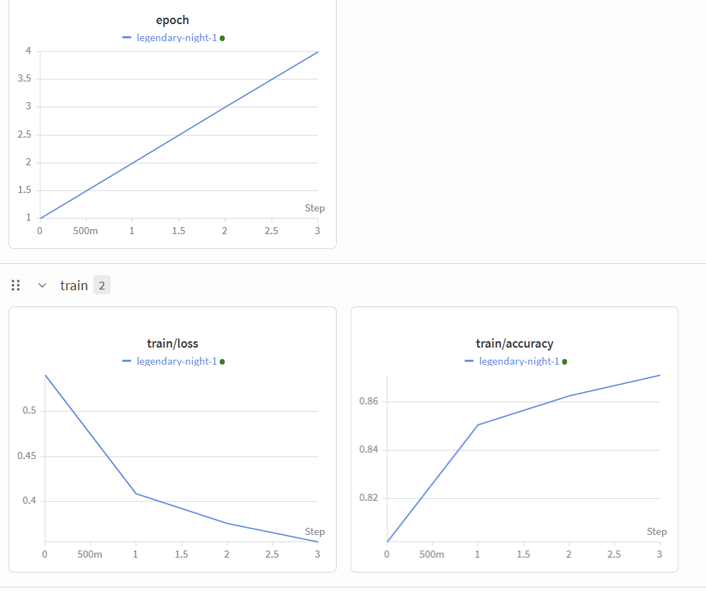

# W&B Lab 1 -- Fashion-MNIST Experiment Tracking

PyTorch MLP trained on Fashion-MNIST with metrics logged to W&B.

Sample image-


## Setup

```bash
pip install torch torchvision wandb numpy scikit-learn
wandb login
```

## Run

```bash
python lab1.py
```

With custom args:

```bash
python lab1.py --epochs 5 --lr 0.0005 --batch_size 128 --dropout 0.3
```

## Tracked Metrics

- `train/loss`, `train/accuracy` -- per epoch
- `val/loss`, `val/accuracy` -- per epoch
- Per-layer gradient distributions (via `wandb.watch`)
- 10-class confusion matrix (logged after final epoch)

Results show up in your W&B dashboard at the link printed in the terminal.
